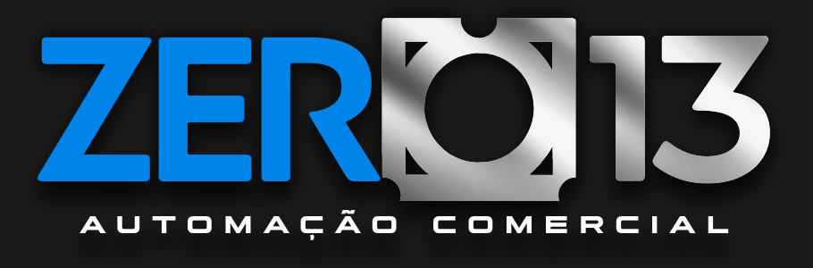
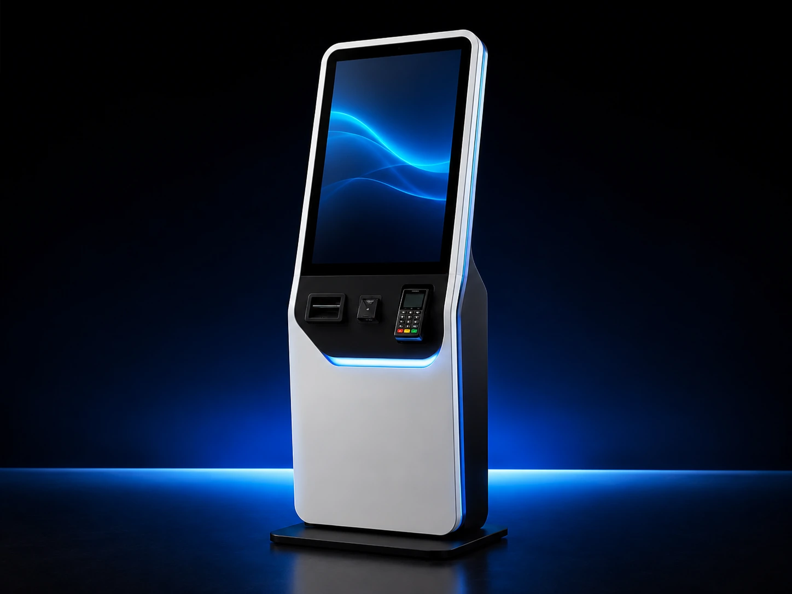
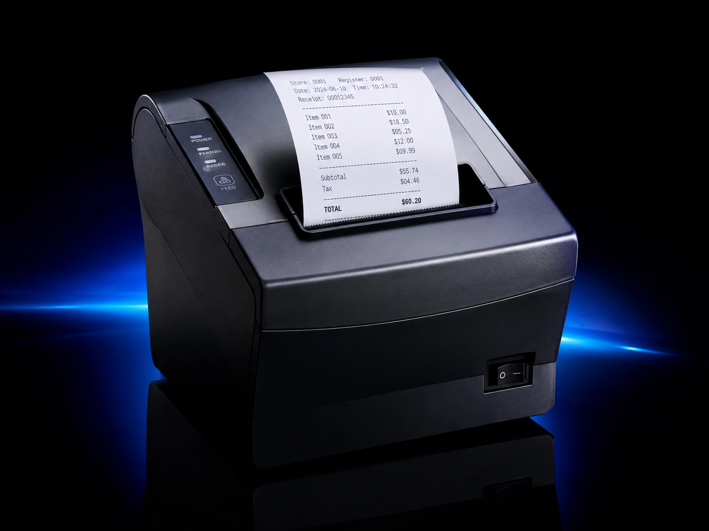
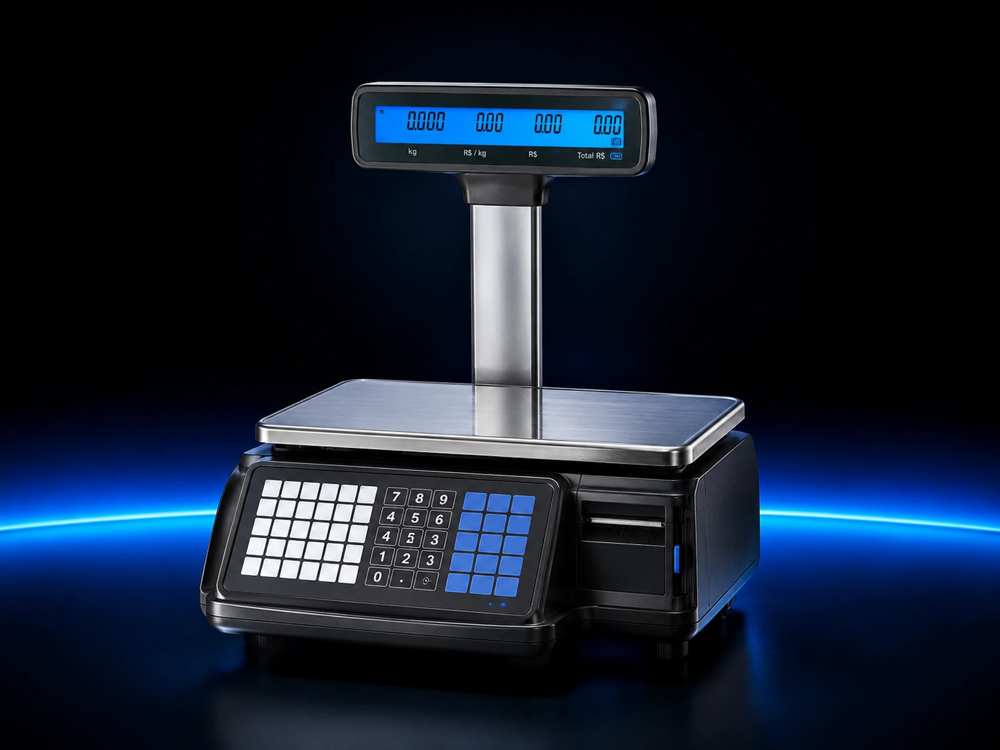
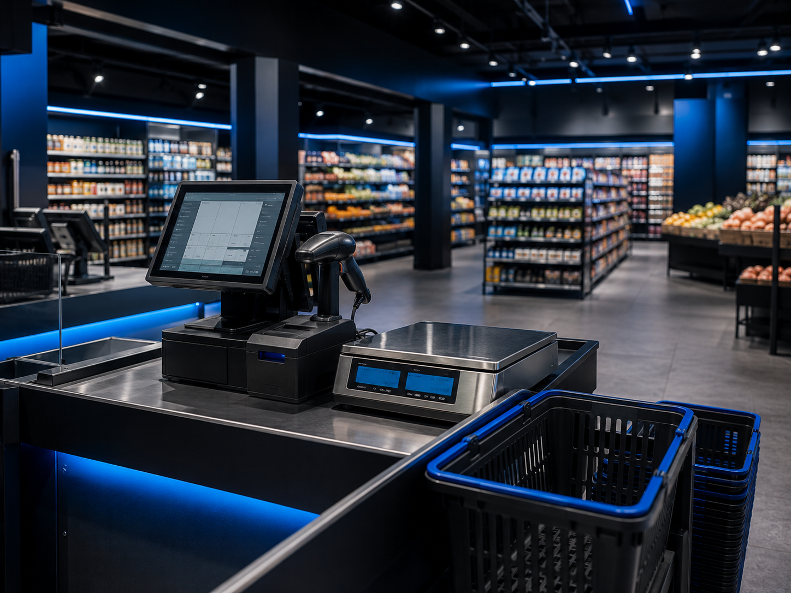
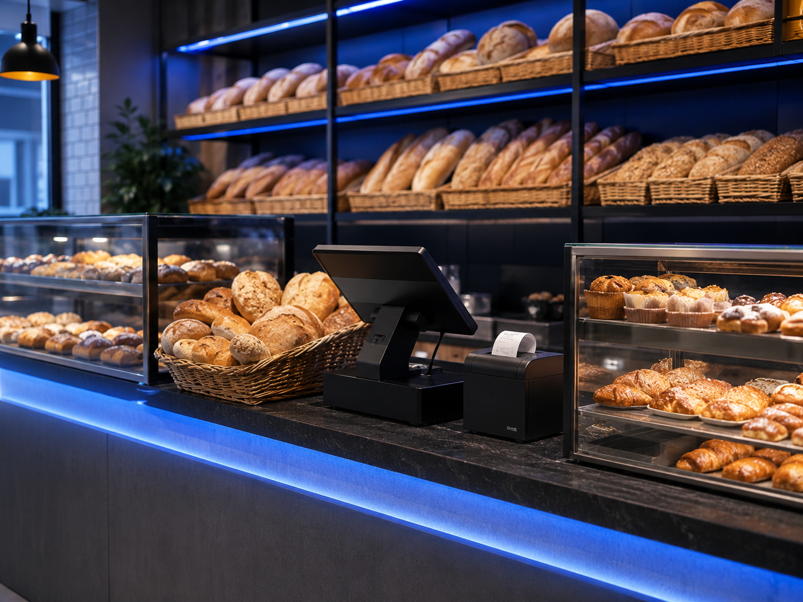
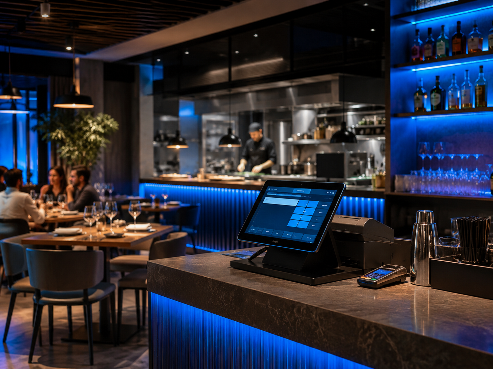
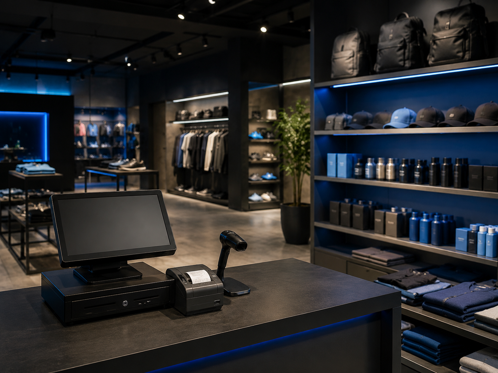

<!DOCTYPE html>
<html lang="pt-BR">
<head>
  <meta charset="UTF-8" />
  <meta name="viewport" content="width=device-width, initial-scale=1.0" />
  <meta name="description" content="Zero13 Automação Comercial - PDV, suporte técnico, equipamentos, redes e soluções para comércio." />
  <title>Zero13 Automação Comercial</title>
  <!-- Versão responsiva atualizada - layout full screen -->

  
</head>
<body>
  <header class="topbar">
    

      

      <nav class="menu" aria-label="Menu principal">
        <a href="#servicos">Serviços</a>
        <a href="#quem-somos">Quem somos</a>
        <a href="#equipamentos">Equipamentos</a>
        <a href="#segmentos">Segmentos</a>
        <a href="#depoimentos">Depoimentos</a>
        <a href="#funcionalidades">Funcionalidades</a>
        <a href="#seguranca">Segurança</a>
        <a href="#contato">Contato</a>
      </nav>

      <a class="btn btn-primary" href="https://wa.me/5513988229261?text=Ol%C3%A1%2C%20gostaria%20de%20falar%20com%20Alexander%20da%20Zero13." target="_blank" rel="noopener noreferrer" data-whatsapp-rotate="true">
        Solicitar demonstração
      </a>
    

  </header>

  <main id="inicio">
    <section class="container hero">
      

        
Automação comercial para empresas que não podem parar

        <h1>PDV, suporte e gestão para o seu comércio.</h1>
        

          A Zero13 Automação Comercial oferece soluções para frente de caixa, retaguarda, equipamentos,
          redes, suporte técnico e organização da operação comercial.
        

        

          <a class="btn btn-primary" href="#contato">Solicitar demonstração</a>
          <a class="btn btn-outline" href="#servicos">Conhecer soluções</a>
        

        

          

            <strong>PDV e retaguarda</strong>
            Venda, controle e gestão
          

          

            <strong>Equipamentos</strong>
            Impressoras, leitores e balanças
          

          

            <strong>Suporte técnico</strong>
            Implantação e manutenção
          

        

        
      

    </section>

    <section id="quem-somos" class="about-section">
      

        

          Quem somos
          <h2>Uma empresa nascida da experiência real no suporte à automação comercial.</h2>
          

            A 013 Automação Comercial une experiência especializada, atendimento próximo e compromisso com o pós-venda.
          

        

        

          

            <h3>Da RRSYSTEM à 013 Automação Comercial.</h3>
            

              A <strong>013 Automação Comercial</strong> nasceu originalmente como <strong>RRSYSTEM</strong>.
              A empresa surgiu depois que dois analistas com mais de 20 anos de experiência, após atuarem por muitos anos em diversas empresas do setor,
              passaram a observar deficiências recorrentes nos atendimentos e, principalmente, nas questões de suporte e pós-venda.
            

            

              A partir dessa experiência prática, nasceu a RRSYSTEM, hoje <strong>013 Automação Comercial</strong>,
              com o objetivo de entregar um atendimento mais próximo, claro e responsável para empresas que dependem
              da tecnologia para vender, controlar e manter sua operação funcionando.
            

            

              Nosso princípio é simples: atender bem para atender sempre,
              trabalhando com honestidade, responsabilidade profissional e preço justo.
            

            

              “Atender bem para atender sempre, com honestidade e preço justo.”
            

          

          

            <article class="about-value-card">
              01
              <strong>Experiência de campo</strong>
              
Conhecimento adquirido em anos de atendimento especializado, implantação de sistemas e suporte em ambientes comerciais reais.

            </article>

            <article class="about-value-card">
              02
              <strong>Suporte e pós-venda</strong>
              
Foco em acompanhar o cliente depois da implantação, reduzindo dúvidas, falhas operacionais e paradas no atendimento.

            </article>

            <article class="about-value-card">
              03
              <strong>Honestidade e preço justo</strong>
              
Atendimento transparente, soluções adequadas à necessidade do cliente e compromisso com relações de longo prazo.

            </article>
          

        

      

    </section>

    <section id="servicos">
      

        

          Serviços
          <h2>Soluções para organizar, vender e controlar melhor.</h2>
          

            Uma estrutura pensada para pequenos e médios comércios que precisam de caixa rápido,
            operação estável e suporte confiável.
          

        

        

          <article class="card">
            
🖥️

            <h3>Sistemas de PDV</h3>
            
Instalação, configuração e suporte para frente de caixa, comandas, vendas, operadores e fechamento de caixa.

          </article>

          <article class="card">
            
📦

            <h3>Retaguarda e estoque</h3>
            
Cadastro de produtos, grupos, preços, fornecedores, estoque, relatórios e organização da gestão comercial.

          </article>

          <article class="card">
            
🧾

            <h3>Equipamentos comerciais</h3>
            
Configuração de impressoras, leitores de código de barras, balanças, pin pad, gavetas e terminais.

          </article>

          <article class="card">
            
🌐

            <h3>Redes e infraestrutura</h3>
            
Organização de rede local, computadores, internet, pontos de venda e ambiente técnico da operação.

          </article>

          <article class="card">
            
🛠️

            <h3>Suporte técnico</h3>
            
Diagnóstico, manutenção preventiva, atendimento remoto, atendimento presencial e orientação operacional.

          </article>

          <article class="card">
            
🔐

            <h3>Segurança da operação</h3>
            
Boas práticas para senhas, usuários, permissões, backup, logs e redução de riscos no ambiente comercial.

          </article>
        

      

    </section>

    <section id="equipamentos">
      

        

          Equipamentos
          <h2>Tecnologia para deixar sua operação mais rápida e profissional.</h2>
          

            Além do sistema, a Zero13 apoia sua empresa na escolha, configuração e integração de equipamentos
            de automação comercial para frente de caixa, atendimento, pesagem e emissão de comprovantes.
          

        

        

          <article class="equipment-card">
            
            

              <h3>Totens de autoatendimento</h3>
              
Agilizam pedidos, reduzem filas e modernizam o atendimento em lojas, restaurantes e operações de alto fluxo.

            

          </article>

          <article class="equipment-card">
            
            

              <h3>Impressoras térmicas</h3>
              
Essenciais para cupons, pedidos de cozinha, senhas, comandas e comprovantes de venda.

            

          </article>

          <article class="equipment-card">
            
            

              <h3>Balanças comerciais</h3>
              
Integração para pesagem, etiquetas, preço por quilo e rotinas de atendimento em mercados e padarias.

            

          </article>

          <article class="equipment-card">
            
            

              <h3>PDV completo</h3>
              
Monitor, gaveta, leitor, pin pad e periféricos configurados para uma operação estável e integrada.

            

          </article>
        

      

    </section>

    <section id="segmentos">
      

        

          Segmentos
          <h2>Atendimento para diferentes tipos de comércio.</h2>
          

            O projeto pode ser adaptado conforme o fluxo de venda, os equipamentos e o nível de controle necessário.
          

        

        

          <article class="card segment-card">
            

              
            

            

              <h3>Mercados</h3>
              
PDV, balança, etiquetas, estoque e controle de preços.

            

          </article>
          <article class="card segment-card">
            

              
            

            

              <h3>Padarias</h3>
              
Balcão, comandas, impressoras e vendas rápidas.

            

          </article>
          <article class="card segment-card">
            

              
            

            

              <h3>Bares e restaurantes</h3>
              
Mesas, comandas, cozinha, delivery e pagamentos.

            

          </article>
          <article class="card segment-card">
            

              
            

            

              <h3>Lojas</h3>
              
Produtos, estoque, operadores, caixa e relatórios.

            

          </article>
        

      

    </section>

    <section id="funcionalidades">
      

        

          Funcionalidades
          <h2>O essencial para uma operação comercial moderna.</h2>
          

            Um bom ambiente de automação deve unir velocidade no atendimento, controle de gestão e segurança operacional.
          

        

        

          

            <h3>Frente de caixa</h3>
            <ul class="feature-list">
              <li>Venda rápida no balcão.</li>
              <li>Controle de caixa e operadores.</li>
              <li>Comandas, mesas e pedidos.</li>
              <li>Integração com impressoras e leitores.</li>
              <li>Pagamentos por cartão, Pix e TEF quando disponível.</li>
            </ul>
          

          

            <h3>Gestão e retaguarda</h3>
            <ul class="feature-list">
              <li>Cadastro de produtos e preços.</li>
              <li>Controle de estoque e fornecedores.</li>
              <li>Relatórios de venda e fechamento.</li>
              <li>Organização de grupos e subgrupos.</li>
              <li>Permissões de usuários e trilhas de auditoria.</li>
            </ul>
          

        

      

    </section>

    <section id="seguranca">
      

        

          <h3>Boas práticas alinhadas à ISO/IEC 27001</h3>
          

            Segurança aplicada ao ambiente comercial para reduzir riscos de parada, perda de dados e acesso indevido.
          

          <ul>
            <li>Controle de acesso por função.</li>
            <li>Uso de credenciais individuais.</li>
            <li>Backup com validação de restauração.</li>
            <li>Registro de alterações críticas.</li>
            <li>Separação entre usuários administrativos e operacionais.</li>
          </ul>
        

        

          Segurança
          <h2>Automação comercial precisa ser rápida e protegida.</h2>
          

            Sistemas de venda lidam com informações sensíveis, fluxo financeiro, cadastros e relatórios.
            Por isso, o projeto deve considerar controle de acesso, backup, documentação e rastreabilidade.
          

        

      

    </section>

    <section id="processo">
      

        

          Processo
          <h2>Como a implantação acontece.</h2>
          

            O atendimento pode começar por uma demonstração, seguida de diagnóstico, configuração,
            implantação e acompanhamento da operação.
          

        

        

          

            
1

            

              <h3>Demonstração</h3>
              
Apresentação da solução e entendimento inicial da operação.

            

          

          

            
2

            

              <h3>Diagnóstico</h3>
              
Levantamento de sistema, equipamentos, rede e necessidades.

            

          

          

            
3

            

              <h3>Implantação</h3>
              
Configuração de PDV, equipamentos, usuários e retaguarda.

            

          

          

            
4

            

              <h3>Suporte</h3>
              
Acompanhamento, ajustes e apoio técnico após a implantação.

            

          

        

      

    </section>

    <section id="depoimentos" class="testimonials-section">
      

        

          Depoimentos
          <h2>Relatos que mostram como a automação melhora a rotina.</h2>
          

            Relatos de cenários comerciais para demonstrar como a automação pode melhorar caixa, atendimento, estoque e pós-venda.
          

        

        

          <article class="testimonial-card" data-testimonial-card>
            
★★★★★

            

              A implantação do PDV deixou nosso caixa muito mais rápido. A equipe conseguiu operar com menos erro e o suporte ajudou bastante nos primeiros dias.
            

            

              
ME

              

                <strong data-testimonial-business>Mercado Estrela Azul</strong>
                Marcelo Ribeiro • Mercado de bairro
              

            

          </article>

          <article class="testimonial-card" data-testimonial-card>
            
★★★★★

            

              Organizamos o balcão, impressora, comandas e fechamento de caixa. O atendimento ficou mais fluido e ganhamos mais controle da rotina da padaria.
            

            

              
PV

              

                <strong data-testimonial-business>Padaria Pão da Vila</strong>
                Carla Pereira • Padaria e confeitaria
              

            

          </article>

          <article class="testimonial-card" data-testimonial-card>
            
★★★★★

            

              A automação ajudou muito nas comandas, mesas e pedidos. Hoje conseguimos acompanhar melhor o movimento e reduzir atrasos no atendimento.
            

            

              
P13

              

                <strong data-testimonial-business>Restaurante Porto 13</strong>
                Renato Silva • Bar e restaurante
              

            

          </article>
        

        

          
          
          
          
        

      

    </section>

    <section id="contato">
      

        

          

            <h2>Solicite uma demonstração da Zero13.</h2>
            

              Fale pelo WhatsApp comercial para avaliar PDV, equipamentos, rede,
              suporte técnico, retaguarda, comandas e organização da sua operação comercial. O atendimento é distribuído alternadamente entre Rafael e Alexander.
            

          

          <a class="btn btn-whatsapp" href="https://wa.me/5513988229261?text=Ol%C3%A1%2C%20gostaria%20de%20falar%20com%20Alexander%20da%20Zero13." target="_blank" rel="noopener noreferrer" data-whatsapp-rotate="true">
            Chamar no WhatsApp
          </a>
        

      

    </section>
  </main>

  <footer>
    

      
©  Zero13 Automação Comercial. Todos os direitos reservados.

      
PDV • Suporte • Equipamentos • Redes • Retaguarda

    

  </footer>

  <a
    class="whatsapp-float"
    href="https://wa.me/5513988229261?text=Ol%C3%A1%2C%20gostaria%20de%20falar%20com%20Alexander%20da%20Zero13."
    target="_blank"
    rel="noopener noreferrer"
    aria-label="Falar com Rafael ou Alexander da Zero13 pelo WhatsApp"
   data-whatsapp-rotate="true">
    Fale pelo WhatsApp
    ☏
  </a>

  
</body>
</html>
